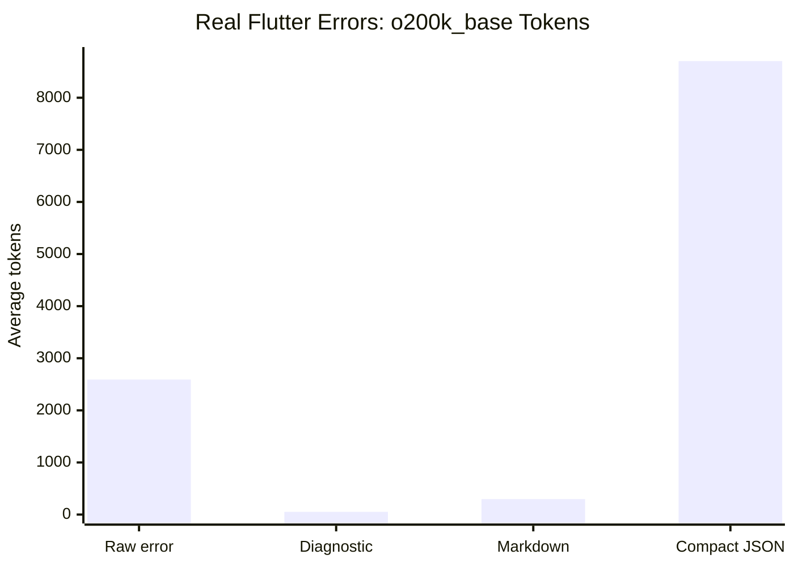
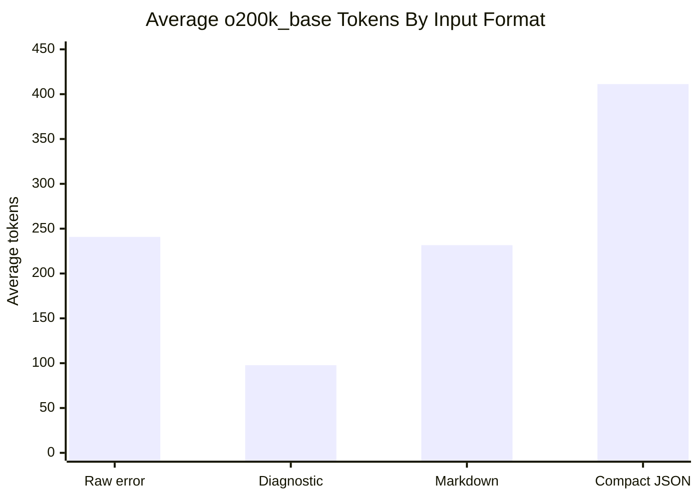
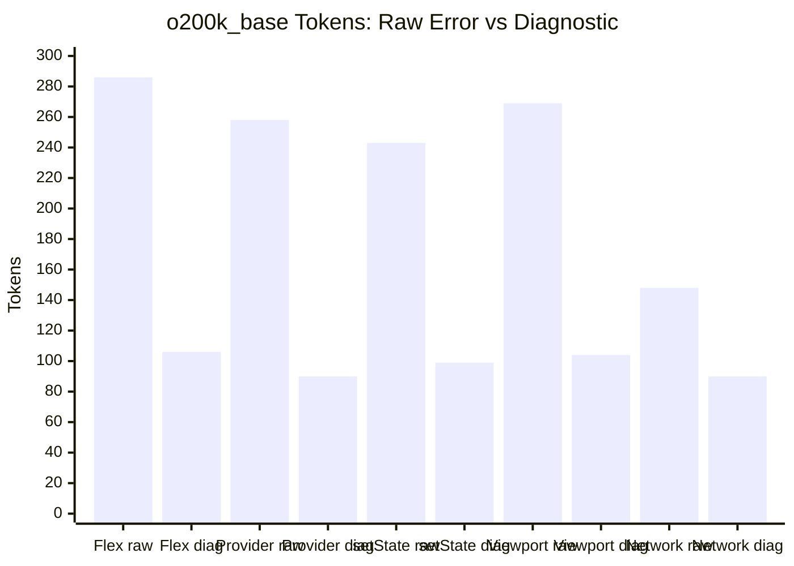
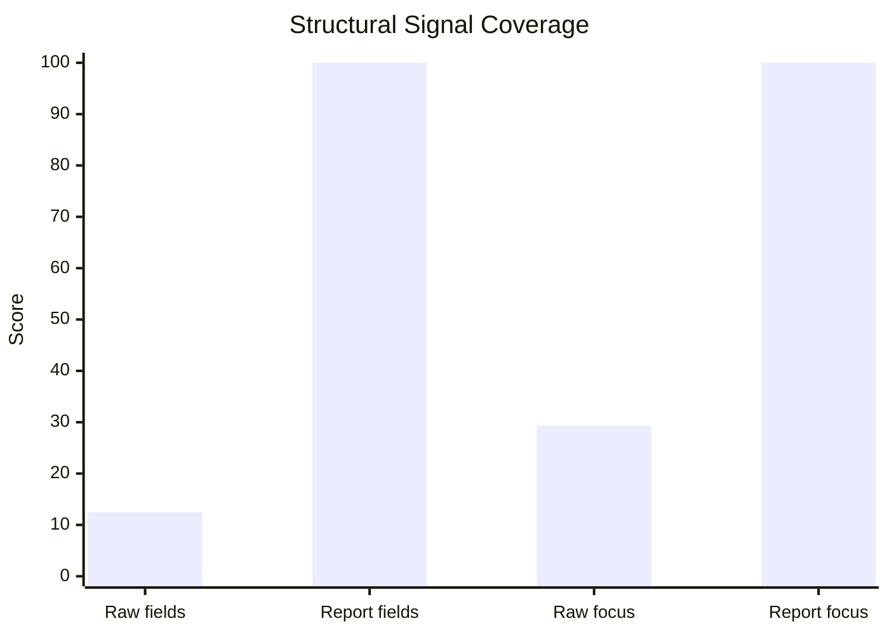
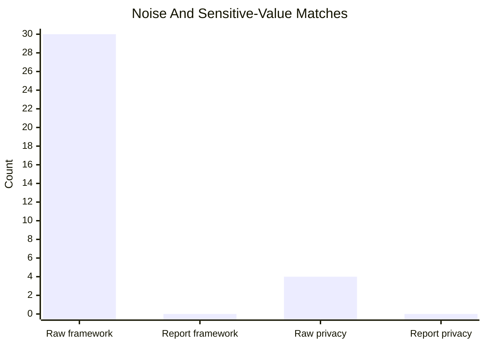

# Benchmark: Raw Runtime Error vs ai_logger

This benchmark compares prompt inputs for debugging Flutter/Dart runtime
failures:

1. Paste the raw runtime error exactly as the console prints it.
2. Paste an equivalent `ai_logger` report for the same failure scenario.

The benchmark has two parts: curated synthetic fixtures for deterministic
structural comparisons, and real Flutter widget-test failures for runtime
evidence. It focuses on prompt cost and signal shape before an LLM call. It
does not claim that a model will always produce a correct fix.

## Reproduce

Run from the package directory:

```bash
cd packages/ai_logger_core
dart run benchmark/raw_vs_ai_report.dart
uv run --with tiktoken python benchmark/openai_token_counts.py
```

Generated artifacts:

- [`raw_vs_ai_report.md`](raw_vs_ai_report.md): deterministic structural-signal
  metrics.
- [`raw_vs_ai_report.json`](raw_vs_ai_report.json): fixture inputs, generated
  reports, and per-case metrics.
- [`openai_token_counts.md`](openai_token_counts.md): real `tiktoken` counts.
- [`openai_token_counts.json`](openai_token_counts.json): tokenizer-count
  source data.
- [`analyzer_vs_runtime.md`](analyzer_vs_runtime.md): evidence that Flutter
  runtime layout/widget-tree errors can pass static analysis.
- [`real_flutter_errors.md`](real_flutter_errors.md): real Flutter widget-test
  runtime error benchmark.
- [`real_flutter_errors.json`](real_flutter_errors.json): raw
  `FlutterErrorDetails` text and captured `ai_logger` reports.
- [`real_flutter_errors/real_render_flex_overflow.md`](real_flutter_errors/real_render_flex_overflow.md):
  captured `RenderFlex` overflow console evidence.
- [`real_flutter_errors/real_vertical_viewport_unbounded_height.md`](real_flutter_errors/real_vertical_viewport_unbounded_height.md):
  captured unbounded `ListView` console evidence.
- [`real_flutter_errors/real_incorrect_parent_data_widget.md`](real_flutter_errors/real_incorrect_parent_data_widget.md):
  captured invalid `Expanded` placement console evidence.
- [`real_flutter_openai_token_counts.md`](real_flutter_openai_token_counts.md):
  real `tiktoken` counts for the Flutter widget-test benchmark.

Run the real Flutter benchmark from the Flutter package:

```bash
cd packages/ai_logger
flutter test benchmark/real_flutter_errors_test.dart

cd ../ai_logger_core
uv run --with tiktoken python benchmark/openai_token_counts.py \
  --input ../../docs/benchmarks/real_flutter_errors.json \
  --markdown-output ../../docs/benchmarks/real_flutter_openai_token_counts.md \
  --json-output ../../docs/benchmarks/real_flutter_openai_token_counts.json
```

## FAQ

### Why not just run `dart analyze`?

Run `dart analyze` or `flutter analyze` first. That is still the right static
analysis layer.

The gap is runtime-only failures. In this benchmark,
`flutter analyze benchmark/real_flutter_errors_test.dart` reports no issues,
but the same file produces real Flutter runtime diagnostics when the widgets are
pumped:

- `RenderFlex` overflow;
- vertical viewport with unbounded height;
- incorrect `ParentDataWidget` placement.

The detailed proof is in
[`analyzer_vs_runtime.md`](analyzer_vs_runtime.md). The short version is:
static analysis checks source before execution; `ai_logger` reports what
actually happened after a screen, layout constraint, route, async callback,
provider scope, network state, or platform callback exists at runtime.

Use both: analyze source first, then capture runtime evidence.

### Is this better than pasting the raw Flutter error?

For the real Flutter runtime benchmark, yes for direct prompt cost. With
`o200k_base`, raw `FlutterErrorDetails` averaged 2591.0 tokens. The
`diagnostic` report averaged 52.0 tokens for the same failures, a 98.0%
reduction. The case-level raw evidence files are linked in
[`real_flutter_errors.md`](real_flutter_errors.md).

### Which report format should an agent paste?

Use `diagnostic` for the cheapest direct LLM prompt. Use `markdown` when the
agent needs richer context and section labels. Use `compactJson` for tools or
machine ingestion; it can be larger than the raw text and is not the best
default for manual chat paste.

### Does this prove LLM fix accuracy?

No. These benchmarks measure prompt-token cost, runtime evidence capture, and
structured signal presence. They do not measure whether an LLM produces the
right code fix on the first attempt. That requires a separate end-to-end repair
benchmark.

## Test Fixtures

The benchmark uses five curated app-level runtime failure fixtures:

| Case | Why It Was Included |
|---|---|
| `render_flex_overflow` | Common Flutter layout error with noisy framework stack frames. |
| `provider_not_found` | Dependency-scope error where route/context information matters. |
| `set_state_after_dispose` | Async lifecycle bug where recent navigation signals are useful. |
| `unbounded_viewport` | Layout constraint error with a known widget-level fix. |
| `network_error_with_sensitive_values` | Runtime failure that includes email/token/bearer-secret values in the raw text. |

Each case has:

- a raw console-style error paste;
- an equivalent `AiReport`;
- `markdown`, `diagnostic`, and `compactJson` output;
- optional source snippets for diagnostic source-frame rendering.

The first four fixtures are hand-authored `AiReport` equivalents rather than
captured output from `installFlutterHooks()`. The network fixture exercises the
core logger/redaction path. Treat the benchmark as a prompt fixture benchmark,
not as proof that every field is produced automatically in every app.

## Evaluation Rules

The benchmark scores two categories.

### Structural Signal Coverage

`benchmark/raw_vs_ai_report.dart` compares raw error text with the generated
Markdown report. It measures field presence and text-shape signals:

| Metric | Rule |
|---|---|
| Rough tokens | A deterministic lexical token proxy used for local comparison. |
| Structured signal coverage | 8 boolean fields: stable kind, primary location, probable cause, suggested fix, recent signals, route context, filtered app frames, diagnostic pointer/source help. |
| App-frame focus | App file mentions divided by app + framework file mentions. |
| Framework-line mentions | Lines mentioning Flutter/provider/dart framework stack locations. |
| Privacy leak matches | Email, bearer token, and secret/token/password style matches. |

Structured signal coverage is not a semantic correctness score. It checks
whether explicit fields are present in the prompt. Raw Flutter console text can
contain natural-language hints that are useful to humans and LLMs but are not
counted by this structural field-presence metric.

### Real Token Counts

`benchmark/openai_token_counts.py` reads `raw_vs_ai_report.json` and uses
`tiktoken` to count actual tokens for:

- `o200k_base`;
- `cl100k_base`.

It compares raw error text against three `ai_logger` formats:

| Format | Intended Use |
|---|---|
| `diagnostic` | Token-efficient direct LLM paste. |
| `markdown` | Rich copy-paste context with sections, recent signals, and diagnostic block. |
| `compactJson` | Tool ingestion and machine processing, not direct LLM paste. |

## Results

### Real Flutter Widget-Test Errors

This benchmark triggers actual Flutter widget-test runtime errors, captures raw
`FlutterErrorDetails` text, and compares it with the report captured through
`ai_logger.installFlutterHooks()` for the same failure.

Cases:

- `RenderFlex overflowed`;
- `Vertical viewport was given unbounded height`;
- `Incorrect use of ParentDataWidget`.



| Format | Avg Raw Tokens | Avg Report Tokens | Delta |
|---|---:|---:|---:|
| `diagnostic` | 2591.0 | 52.0 | -98.0% |
| `markdown` | 2591.0 | 296.3 | -88.6% |
| `compactJson` | 2591.0 | 8703.3 | +235.9% |

The raw side is intentionally the actual `FlutterErrorDetails` text plus stack
trace from `flutter_test`, which is extremely verbose for layout and widget-tree
errors. Device console and IDE output can differ, but this captures the same
class of runtime-only failure that `dart analyze` cannot see.

### Actual Token Counts

Across the five curated synthetic fixtures:



| Encoding | ai_logger Format | Avg Raw Tokens | Avg Report Tokens | Delta |
|---|---|---:|---:|---:|
| `o200k_base` | `diagnostic` | 240.8 | 97.8 | -59.4% |
| `o200k_base` | `markdown` | 240.8 | 231.6 | -3.8% |
| `o200k_base` | `compactJson` | 240.8 | 411.2 | +70.8% |
| `cl100k_base` | `diagnostic` | 242.4 | 96.2 | -60.3% |
| `cl100k_base` | `markdown` | 242.4 | 229.8 | -5.2% |
| `cl100k_base` | `compactJson` | 242.4 | 408.8 | +68.6% |

Per-case `o200k_base` diagnostic results:



| Case | Raw Tokens | Diagnostic Tokens | Delta |
|---|---:|---:|---:|
| `render_flex_overflow` | 286 | 106 | -62.9% |
| `provider_not_found` | 258 | 90 | -65.1% |
| `set_state_after_dispose` | 243 | 99 | -59.3% |
| `unbounded_viewport` | 269 | 104 | -61.3% |
| `network_error_with_sensitive_values` | 148 | 90 | -39.2% |

### Structural Signal Coverage

Markdown reports carry richer debugging context than raw console pastes:



Structured signal fields are shown as a percentage of the 8 evaluated fields.
App-frame focus is the percentage of app file mentions among app + framework
file mentions.

| Metric | Raw Runtime Paste | ai_logger Markdown Report | Delta |
|---|---:|---:|---:|
| Average rough tokens | 254.8 | 213.0 | -16.4% |
| Average structured signal fields | 1.0/8 | 8.0/8 | +7.0 |
| Average app-frame focus | 29.4% | 100.0% | +70.6pp |
| Framework-line mentions | 30 | 0 | -30 |
| Privacy leak matches | 4 | 0 | -4 |



## Interpretation

The strongest token-efficiency result in these fixtures is the `diagnostic`
format. It keeps the stable error kind, primary file/line, source pointer when a
source loader is available, and fix hint while dropping most headings,
framework stack noise, and repeated explanatory prose. That makes it the
shortest measured direct-paste format in this benchmark.

Markdown is useful when the developer wants richer context, including recent
signals and a structured report body. It is only modestly shorter than raw
runtime text because it intentionally includes more explanatory context.

Compact JSON is not optimized for direct chat input. It is larger because field
names, escaped strings, stack data, context, and breadcrumbs are preserved for
tools.

## Limitations

This benchmark is deterministic and easy to reproduce, but it is not a model
accuracy benchmark. It does not measure whether a specific LLM returns a
correct patch.

It also is not an end-to-end Flutter runtime capture benchmark. Most fixtures
manually construct the `AiReport` fields being compared. In a real Flutter app,
the exact available fields depend on the installed hooks, classifier coverage,
route observer usage, manually added breadcrumbs, redaction rules, and whether
a `reportSourceLoader` or CLI source loader is available.

The `provider_not_found` fixture is especially optimistic as an app-frame
example. The current stack filtering policy may retain third-party package
frames before the app frame unless the app or future API supplies stronger
package-boundary information.

The structural coverage score is intentionally simple and favors explicit
sections. It does not give raw console prose semantic credit for equivalent
cause or fix hints. A stricter evaluation should use a blind rubric or compare
both prompts against expected root cause, fix, and primary app frame.

A model-level benchmark should use the raw/report pairs in
[`raw_vs_ai_report.json`](raw_vs_ai_report.json), send both inputs through the
same prompt and model settings, then score:

- first-pass test success;
- correct file/line identification;
- correct root-cause classification;
- number of conversation turns to a passing fix;
- total input and output tokens used through the full debugging exchange.
