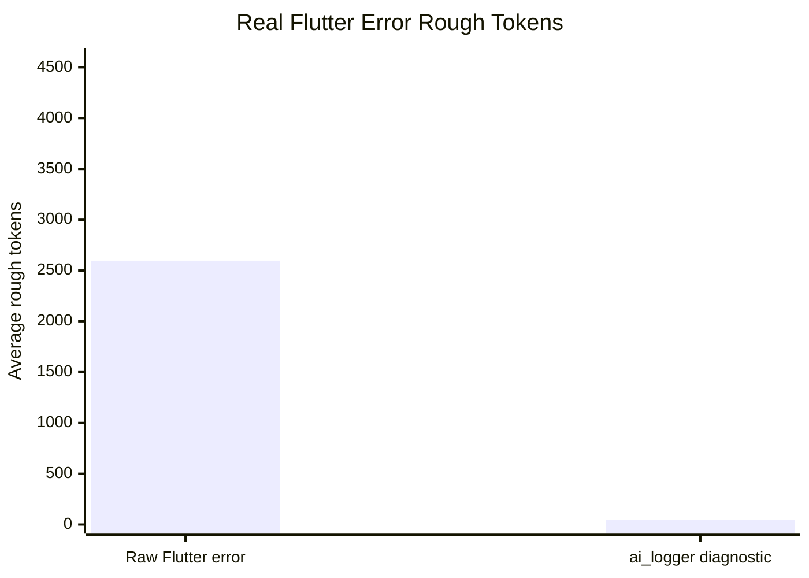

# Real Flutter Runtime Error Benchmark

Generated by `packages/ai_logger/benchmark/real_flutter_errors_test.dart`.

This benchmark triggers real Flutter widget-test runtime errors, captures the raw `FlutterErrorDetails` text, and compares it with reports emitted through `ai_logger.installFlutterHooks()` for the same failure.

## Summary

| Metric | Raw Flutter error | ai_logger diagnostic | Delta |
|---|---:|---:|---:|
| Average rough tokens | 2597.3 | 43.0 | -98.3% |
| Framework-line mentions | 281 | 0 | -281 |
| Average structured signal fields | 0.0/8 | 2.7/8 | +2.7 |

## Case Results

| Case | Evidence | Raw rough tokens | Diagnostic rough tokens | Diagnostic delta | Raw framework lines | Diagnostic framework lines |
|---|---|---:|---:|---:|---:|---:|
| real_render_flex_overflow | [raw/report](real_flutter_errors/real_render_flex_overflow.md) | 467 | 29 | -93.8% | 0 | 0 |
| real_vertical_viewport_unbounded_height | [raw/report](real_flutter_errors/real_vertical_viewport_unbounded_height.md) | 2702 | 52 | -98.1% | 93 | 0 |
| real_incorrect_parent_data_widget | [raw/report](real_flutter_errors/real_incorrect_parent_data_widget.md) | 4623 | 48 | -99.0% | 188 | 0 |

## Notes

This is closer to the production claim than the curated fixture benchmark because the Flutter errors are actually raised by widgets. It still runs inside `flutter_test`, so raw output can differ from a device console or IDE log pane.

`ai_logger` classification currently covers common framework error text. Errors that are not covered fall back to `flutter_error` and still get location, stack, route context, breadcrumbs, and recent signals when those are available.
